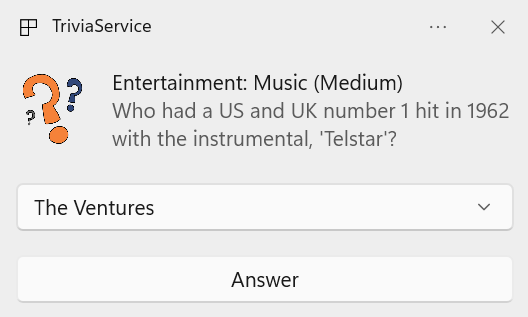
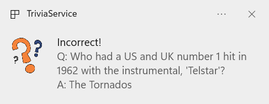

# TriviaService

Simple service to ask trivia questions via Windows notifications.

## Setup

### Dependencies
1. Download and install the .NET 6.0 SDK: https://dotnet.microsoft.com/en-us/download/dotnet/6.0

### Build

`build.cmd`

### Test

`test.cmd`

## Usage

1. Run `TriviaService.exe` to start
2. Press Ctrl+C to stop

## History

This project was started by [Jon Thysell](mailto://jthysell@microsoft.com) as a part of the March 2024 FHL.
